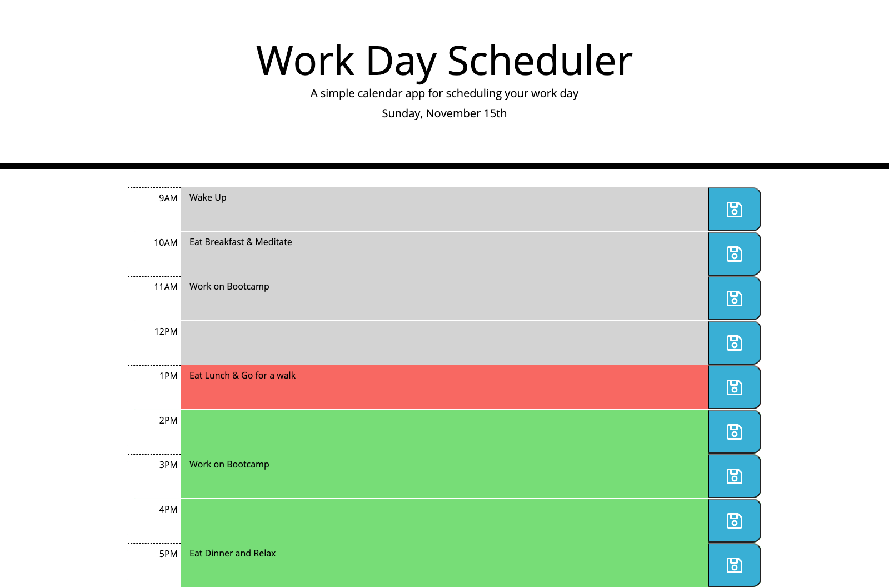

# Work Day Scheduler

## Purpose
An online daily scheduler that users are able to add tasks to. The scheduler displays the current day and is color coded to visually display past, current, and future times. Tasks save to localStorage so that the user can leave the site and not lose their current tasks.

## Built With
* HTML
* CSS
* JavaScript
* Moment.js
* jQuery

## Website
https://jbeedle19.github.io/work-day-scheduler/

## Screenshots

## Contribution
Made with ❤️ by Joshua Beedle